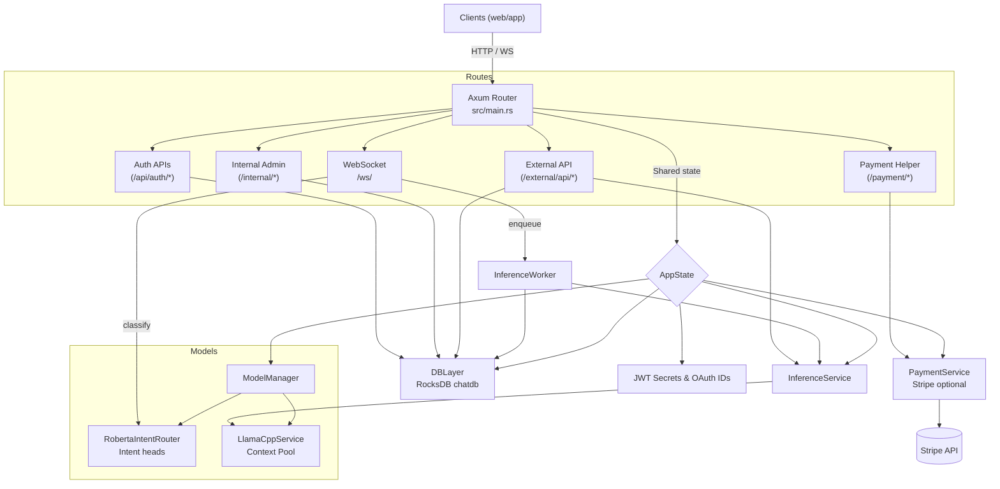

# Ktulhu Main

Multi-model inference server that powers the conversational Ktulhu experience. The binary exposes WebSocket streaming chat, authenticated REST APIs, Stripe-powered upgrades, and an internal admin surface on top of local `llama.cpp` models, a RoBERTa intent router, and a RocksDB chat store.

## Highlights
- Streaming inference through `llama.cpp` with configurable context pools, sampling knobs, and back-pressure aware workers.
- Multi-surface API: WebSocket chat (`/ws`), customer-facing REST under `/external/api`, internal admin tools under `/internal`, and auth/payment helpers.
- On-disk persistence via RocksDB (`chatdb`) for chats, messages, users, and device indexes so state survives restarts.
- Intent routing powered by a fine-tuned XLM-RoBERTa checkpoint plus custom heuristics to pick prompt templates, reasoning modes, and support escalation paths.
- Optional automation: a local agent CLI can execute shell/file tools by prompting the same mistral backend.

## Repository Layout
- `src/main.rs` – application entry point, router composition, and shared state wiring.
- `src/manager.rs` – discovers llama.cpp binaries/models, intent router checkpoints, and exposes `ModelManager` handles.
- `src/ws/` – WebSocket router, session management, queueing worker, and summarization logic.
- `src/external_api/`, `src/internal_api/`, `src/auth/`, `src/payment/` – HTTP surfaces for public, admin, auth, and Stripe flows.
- `src/inference/` – thin abstraction around llama.cpp plus the RoBERTa intent router implementation.
- `src/db/` – RocksDB wrapper that persists chats, messages, users, devices, API keys, and indexes.
- `src/conversation/`, `src/prompts/`, `chat_template.jinja` – prompt templating, trimming, and attachment summary helpers.
- `llama.cpp/`, `models/` – third-party backend and local GGUF checkpoints (make sure they exist before running).
- `config/` – environment snippets for llama.cpp and Stripe plus a CORS whitelist file.
- `docs/` – focused guides for llama.cpp configuration and frontend payment integration.

## Runtime Architecture
```
Clients (web/app) ──HTTP/WebSocket──> Axum router (src/main.rs)
    ↳ /api/auth/* ───> OAuth & email flows → JWT minting
    ↳ /ws ──> ws::handler (register/prompt/cancel)
            ↳ classifier (intent_router + heuristics)
            ↳ InferenceWorker queue → llama.cpp contexts
            ↳ DBLayer (chat persistence + summaries)
    ↳ /external/api/* ─> token-gated one-shot completions & usage
    ↳ /internal/* ─> admin dashboards, device/chat inspectors
    ↳ /payment/* ─> Stripe Checkout helper (optional)
```
Key supporting services:
- **ModelManager** preloads llama.cpp contexts and the RoBERTa classifier, exposing Arc handles reused across threads.
- **InferenceService** streams tokens or full completions to both REST and WS surfaces while honoring cancellation flags.
- **DBLayer** centralizes RocksDB reads/writes, including indices that map devices/users to chats and message likes.
- **Prompts & attachments** convert stored history into chat templates, add attachment summaries, and keep responses clean.

### Mermaid Overview


## Function Overview
| Area | File | Key functions | Description |
| --- | --- | --- | --- |
| Bootstrapping & routing | `src/main.rs:23` | `main`, `load_allowed_origins` | Loads env files, builds shared `AppState`, composes auth/internal/external/payment routers, and configures CORS + listeners. |
| Model lifecycle | `src/manager.rs:12` | `ModelManager::new` | Validates llama binaries/models, Tunes ctx/temp/top-* knobs, opens the RoBERTa snapshot, and hands out `Arc<LlamaCppService>` + `Arc<RobertaIntentRouter>`. |
| Inference facade | `src/inference/mod.rs:18` | `InferenceService::generate_stream`, `generate_completion` | Wraps the llama backend so HTTP/WS callers receive either live token streams or blocking completions with shared cancellation. |
| llama.cpp backend | `src/inference/llama_cpp_service.rs:116` | `LlamaCppService::new`, `generate_stream`, `generate_completion` | Initializes `libllama` once, builds a configurable context pool, and runs sampling loops that feed MPSC channels back to Tokio tasks. |
| Intent routing & prompts | `src/inference/intent_router.rs:27`, `src/classifier/routing/mod.rs:114` | `RobertaIntentRouter::load`, `RobertaIntentRouter::classify`, `route_intent` | Loads tokenizer + multi-head classifier, scores speech-act/domain/expectation/support heads, and produces routing notes & prompt keys for downstream prompt builders. |
| WebSocket edge | `src/ws/handler.rs:31` | `AppState`, `ws_router`, `handle_socket`, `classify_with_timeout` | Manages WS sessions (register/prompt/cancel), attaches attachment summaries, throttles classifier calls, persists prompts, and enqueues jobs when backpressure allows. |
| Streaming worker | `src/ws/inference_worker.rs:17` | `InferenceWorker::new`, `process_job`, `generate_summary_message` | Runs bounded queues, streams tokens to browsers, saves assistant turns, refreshes chats, and opportunistically emits summary messages. |
| Persistence & admin | `src/db/mod.rs:18` | `DBLayer::save_message` (line 113), `list_recent_messages` (line 191), `list_chats_for_device` (line 364), `remove_messages_by_role` (line 435) | Encapsulates RocksDB access used everywhere plus helper indices for device/user lookups and summary maintenance accessed by internal admin handlers (`src/internal_api/handlers.rs:75`, `309`). |
| External APIs & payments | `src/external_api/handlers.rs:95`, `src/payment/mod.rs:35`, `src/auth/google.rs:42`, `src/bin/agent_cli.rs:1` | `generate`, `profile`, `PaymentService::from_env`, `google_login_handler`, `agent::run_agent` | Provide token-gated REST completions/usage, Stripe checkout flows, OAuth login/JWT minting, and the optional agent CLI that reuses the same model stack for automation. |

## Setup
### Prerequisites
- Rust stable toolchain (2021 edition) + `cargo`.
- `cmake`, a C/C++ compiler, and (optionally) CUDA/cuBLAS if you want GPU acceleration for `llama.cpp`.
- Python is only needed if you regenerate tokenizer/model artifacts, not for the core server.

### Bootstrap llama.cpp & models
1. Clone submodules: `git submodule update --init --recursive`.
2. Build llama.cpp locally:
   ```bash
   cmake -S llama.cpp -B llama.cpp/build -DLLAMA_CUBLAS=on
   cmake --build llama.cpp/build --config Release -j$(nproc)
   ```
3. Drop the desired GGUF into `models/` (defaults expect `models/Ministral3-14B-Resoning-gguf/...Q8_0.gguf`).
4. Optionally edit `config/llamacpp.env` to point at custom binaries, GGUF files, or sampling knobs. Source this file (or copy values into `.env`).

### Environment configuration
Create a `.env` in the repo root; at minimum you need:
- `JWT_SECRET` – used by auth + WebSocket identity.
- `GOOGLE_CLIENT_ID` / `APPLE_CLIENT_ID` – required to enable their respective login paths; leave unset to disable gracefully.
- `INTENT_ROUTER_DIR` – optional override when RoBERTa checkpoints live outside `models/`.
- Stripe variables (see below) if you want checkout flows.
Also edit:
- `config/allowed_origins.txt` to whitelist CORS origins (reload requires a restart).
- `config/payment.env` & `config/llamacpp.env` for ready-to-source defaults.

### Running locally
```bash
source config/llamacpp.env          # optional but recommended
source config/payment.env           # optional
cargo run --release
```
The server listens on `http://0.0.0.0:3000` and prints the enabled routes. RocksDB files live under `chatdb/`; delete that folder to wipe local state.

### Payments (Stripe)
Set `STRIPE_PUBLISHABLE_KEY`, `STRIPE_SECRET_KEY`, `STRIPE_PRICE_ID`, `STRIPE_CHECKOUT_MODE`, `STRIPE_SUCCESS_URL`, and `STRIPE_CANCEL_URL` (see `docs/frontend_payment.md`). When all are present, the `/payment` routes automatically expose Checkout helpers and the boot log confirms activation.

## APIs
### Authentication
- `POST /api/auth/google` and `POST /api/auth/apple` exchange ID tokens for the project JWT (`src/auth/mod.rs`).
- `POST /api/auth/register` + `POST /api/auth/login` implement password-based auth for fallback flows.
- Devices register via the WebSocket `register` message, which calls `ensure_chat_for_device` to make sure chats exist (`src/internal_api/handlers.rs:309`).

### WebSocket chat (`/ws`)
Message types:
- `register` – ties a device hash + chat ID to the session and returns historical context.
- `prompt` – carries text, optional language, and attachment metadata; handler routes intents, stores the user turn, and enqueues inference.
- `cancel` – flips the shared `AtomicBool` so workers stop streaming.
Replies stream `{"type":"assistant","token":...}` chunks, followed by a terminal `{"type":"assistant","done":true}` envelope. Summaries are inserted automatically when conditions in `should_generate_summary` are met.

### External REST API (`/external/api`)
- `POST /external/api/generate` – single-turn completion using the stored prompt template. Requires `Authorization: Bearer <jwt>`.
- `GET /external/api/profile` and `/external/api/usage` – inspect quotas/roles.
- `/external/api/credentials/*` – CRUD for per-user API keys.

### Internal admin (`/internal`)
- `/internal/chat-thread/{chat_id}` – fetch/delete chat history or upload summaries.
- `/internal/chats/by-device/{hash}` and `/internal/chats/by-user/{user_id}` – inspect device/user scopes.
- `/internal/admin/*` – HTML dashboards for overview, users, devices, and latest message feeds.
All internal routes sit behind middleware that checks `require_internal_auth` (see `src/internal_api/mod.rs`).

### Payment helper (`/payment`)
- `POST /payment/create-checkout-session` – returns `{ session_id, checkout_url }` for the authenticated user.
- `GET /payment/config` – exposes the publishable key so the frontend can lazy-load Stripe.js.
- `POST /payment/activate` – finalizes roles after Stripe redirects back with `session_id`.

## Development Workflow
- Format + lint: `cargo fmt`, `cargo clippy --all-targets --all-features`.
- Tests: `cargo test` (unit coverage lives mostly in helper crates; integration relies on running RocksDB + llama.cpp mocks).
- Logs: enable more verbose tracing with `RUST_LOG=debug,ktulhuMain=debug cargo run`.
- The agent CLI: run `cargo run --bin agent_cli -- "Describe latest admin stats"` to exercise `agent::run_agent` against the same backend for local automation.

## Reference Material
- `docs/llama-cli-env.md` – deeper explanation of llama.cpp environment variables, pool sizing, and classifier overrides.
- `docs/frontend_payment.md` – frontend checklist for integrating the Stripe helper.
- `chat_template.jinja` – tweak this to change how history/system prompts feed the GGUF checkpoint.
- `config/allowed_origins.txt`, `config/llamacpp.env`, `config/payment.env` – edit & source these instead of hard-coding values in `.env` when possible.

With the README in place you can onboard contributors quickly: start llama.cpp, point to a GGUF, add Stripe keys if needed, run `cargo run`, and connect either with the browser client or the standalone agent CLI.
