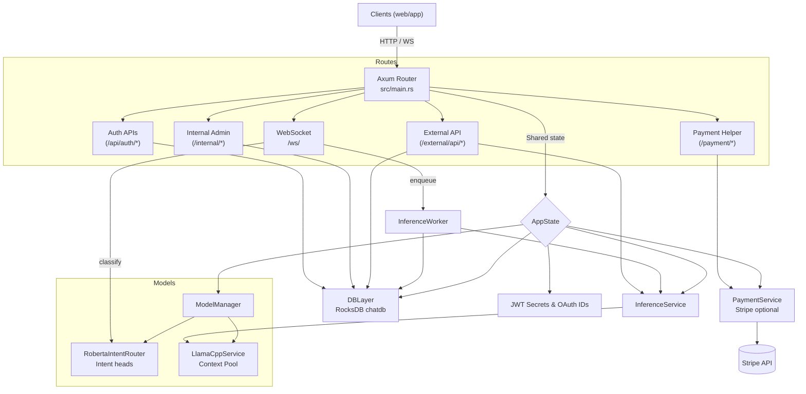

# Ktulhu Main

**Rust-based conversational inference platform with deterministic intent routing.**

Ktulhu Main is the core backend powering the conversational Ktulhu system. It combines a high-performance Rust service with local LLM inference through `llama.cpp`, a fine-tuned XLM-RoBERTa intent router, and persistent chat storage via RocksDB.

Instead of relying entirely on the language model to infer user intent, Ktulhu first classifies incoming messages using a lightweight intent router. The router determines conversational context (phatic vs contentful) and several behavioral attributes before dynamically assembling optimized prompts. This architecture improves response consistency, reduces unnecessary generation work, and enables predictable conversational behavior even when running smaller quantized models.

The server exposes real-time WebSocket chat, authenticated REST APIs, Stripe-powered upgrades, and internal administrative tooling. It supports web and native clients while remaining fully self-hosted and hardware-flexible.

---

## Highlights

- **Streaming LLM inference** through `llama.cpp`, with configurable context pools, sampling controls, and back-pressure aware worker scheduling.
- **Deterministic intent routing** using a fine-tuned XLM-RoBERTa classifier that decomposes user messages into conversational attributes before generation.
- **Dynamic prompt assembly** with language-aware prompt fragments and reasoning modes, improving output quality while keeping the base model unchanged.
- **Hardware-flexible inference runtime** supporting CPU-only deployments, single-GPU setups, and multi-GPU configurations through quantized GGUF models.
- **Multi-surface API architecture** with WebSocket chat (`/ws`), customer-facing REST APIs under `/external/api`, internal admin tools under `/internal`, and authentication/payment helpers.
- **Persistent chat storage** via RocksDB (`chatdb`) storing users, messages, chats, and device indexes so state survives restarts.
- **Multilingual prompt orchestration** with device-side language detection and language-specific prompt components stored under `lang/`.
- **Optional automation layer** where a local agent CLI can execute shell or file-system tools by routing tasks through the same Mistral inference backend.

  
## Repository Layout
- `src/main.rs` – application entry point, router composition, and shared state wiring.
- `src/manager.rs` – discovers llama.cpp binaries/models, intent router checkpoints, and exposes `ModelManager` handles.
- `src/ws/` – WebSocket router, session management, queueing worker, and summarization logic.
- `src/external_api/`, `src/internal_api/`, `src/auth/`, `src/payment/` – HTTP surfaces for public, admin, auth, and Stripe flows.
- `src/inference/` – thin abstraction around llama.cpp plus the RoBERTa intent router implementation.
- `src/db/` – RocksDB wrapper that persists chats, messages, users, devices, API keys, and indexes.
- `src/conversation/`, `src/prompts/`, `chat_template.jinja` – prompt templating, trimming, and attachment summary helpers.
- `llama.cpp/`, `models/` – third-party backend and local GGUF checkpoints (make sure they exist before running).
- `config/` – environment snippets for llama.cpp and Stripe plus a CORS whitelist file.
- `docs/` – focused guides for llama.cpp configuration and frontend payment integration.

## Runtime Architecture
```
Clients (web/app) ──HTTP/WebSocket──> Axum router (src/main.rs)
↳ /api/auth/* ───> OAuth & email flows → JWT minting

↳ /ws ──> ws::handler (register / prompt / cancel)
        ↳ language hint from device metadata
        ↳ intent router (XLM-RoBERTa + heuristics)
            ↳ phatic vs contentful split
            ↳ speech act classification
            ↳ domain classification
            ↳ expectation detection
            ↳ optional support intent detection
        ↳ prompt assembly
            ↳ language-aware templates (lang/*)
            ↳ reasoning profile selection
            ↳ domain / expectation modifiers
        ↳ InferenceWorker queue
            ↳ llama.cpp context pool
            ↳ streaming token generation
        ↳ DBLayer
            ↳ message persistence
            ↳ conversation summaries

↳ /external/api/* ─> token-gated one-shot completions & usage reporting

↳ /internal/* ─> admin dashboards, device/chat inspectors

↳ /payment/* ─> Stripe Checkout helper (optional)
```
### Supporting Services

**ModelManager**

- Preloads llama.cpp inference contexts and the XLM-RoBERTa classifier.
- Exposes shared `Arc` handles reused across worker threads.
- Enables hardware-flexible deployments (CPU, single GPU, or multi-GPU).

**InferenceService**

- Streams tokens or full completions to both WebSocket and REST clients.
- Coordinates inference workers and honors cancellation signals.
- Applies prompt templates and sampling configuration before generation.

**Intent Router**

- Fine-tuned XLM-RoBERTa classifier with multiple prediction heads.
- Determines conversational intent before LLM generation.
- Predicts several conversational attributes:

  - speech act (SOCIAL / ASKING / DIRECTING / EXPRESSING / SHARING)
  - domain (technical, personal, legal, social, etc.)
  - expectation (INFO / ADVICE / ACTION / NONE)
  - optional support intent
  - phatic vs contentful conversation

- Routing decisions determine:

  - final conversational intent
  - prompt template selection
  - reasoning profile activation
  - task vs chat execution path

**Prompt Assembly**

- Prompt fragments are stored under `lang/` for multilingual support.
- Language detection is performed client-side and passed as metadata.
- Prompt templates are dynamically assembled from:

  - language
  - intent router decisions
  - reasoning profiles
  - conversation history

- This approach improves response consistency without modifying the base LLM.

**DBLayer**

- Centralizes RocksDB reads/writes.
- Stores chats, messages, users, and device mappings.
- Maintains indices linking users/devices to conversation histories.
- Enables persistence across server restarts.

**Automation Layer (optional)**

- A local agent CLI can execute shell or file-system operations.
- Tool results can be routed back through the same inference pipeline.

### Mermaid Overview

```mermaid
graph TD
    A["Clients (web/app)"] -->|HTTP / WS| B["Axum Router<br/>src/main.rs"]

    subgraph Routes
        B --> C1["Auth APIs<br/>(/api/auth/*)"]
        B --> C2["External API<br/>(/external/api/*)"]
        B --> C3["WebSocket<br/>/ws/"]
        B --> C4["Internal Admin<br/>(/internal/*)"]
        B --> C5["Payment Helper<br/>(/payment/*)"]
    end

    B -->|Shared state| D{AppState}

    D --> E["DBLayer<br/>RocksDB chatdb"]
    D --> F["InferenceService"]
    D --> G["ModelManager"]
    D --> H["PaymentService<br/>Stripe optional"]
    D --> I["JWT Secrets & OAuth IDs"]

    subgraph Models
        G --> J["RobertaIntentRouter<br/>Intent heads"]
        G --> K["LlamaCppService<br/>Context Pool"]
    end

    F --> K

    C3 -->|classify| J
    C3 -->|enqueue| L["InferenceWorker"]

    L --> F
    L --> E

    C2 --> F
    C2 --> E

    C4 --> E
    C5 --> H --> S[(Stripe API)]
    C1 --> E
```

## Function Overview
| Area | File | Key functions | Description |
| --- | --- | --- | --- |
| Bootstrapping & routing | `src/main.rs:23` | `main`, `load_allowed_origins` | Loads env files, builds shared `AppState`, composes auth/internal/external/payment routers, and configures CORS + listeners. |
| Model lifecycle | `src/manager.rs:12` | `ModelManager::new` | Validates llama binaries/models, Tunes ctx/temp/top-* knobs, opens the RoBERTa snapshot, and hands out `Arc<LlamaCppService>` + `Arc<RobertaIntentRouter>`. |
| Inference facade | `src/inference/mod.rs:18` | `InferenceService::generate_stream`, `generate_completion` | Wraps the llama backend so HTTP/WS callers receive either live token streams or blocking completions with shared cancellation. |
| llama.cpp backend | `src/inference/llama_cpp_service.rs:116` | `LlamaCppService::new`, `generate_stream`, `generate_completion` | Initializes `libllama` once, builds a configurable context pool, and runs sampling loops that feed MPSC channels back to Tokio tasks. |
| Intent routing & prompts | `src/inference/intent_router.rs:27`, `src/classifier/routing/mod.rs:114` | `RobertaIntentRouter::load`, `RobertaIntentRouter::classify`, `route_intent` | Loads tokenizer + multi-head classifier, scores speech-act/domain/expectation/support heads, and produces routing notes & prompt keys for downstream prompt builders. |
| WebSocket edge | `src/ws/handler.rs:31` | `AppState`, `ws_router`, `handle_socket`, `classify_with_timeout` | Manages WS sessions (register/prompt/cancel), attaches attachment summaries, throttles classifier calls, persists prompts, and enqueues jobs when backpressure allows. |
| Streaming worker | `src/ws/inference_worker.rs:17` | `InferenceWorker::new`, `process_job`, `generate_summary_message` | Runs bounded queues, streams tokens to browsers, saves assistant turns, refreshes chats, and opportunistically emits summary messages. |
| Persistence & admin | `src/db/mod.rs:18` | `DBLayer::save_message` (line 113), `list_recent_messages` (line 191), `list_chats_for_device` (line 364), `remove_messages_by_role` (line 435) | Encapsulates RocksDB access used everywhere plus helper indices for device/user lookups and summary maintenance accessed by internal admin handlers (`src/internal_api/handlers.rs:75`, `309`). |
| External APIs & payments | `src/external_api/handlers.rs:95`, `src/payment/mod.rs:35`, `src/auth/google.rs:42`, `src/bin/agent_cli.rs:1` | `generate`, `profile`, `PaymentService::from_env`, `google_login_handler`, `agent::run_agent` | Provide token-gated REST completions/usage, Stripe checkout flows, OAuth login/JWT minting, and the optional agent CLI that reuses the same model stack for automation. |

## Setup
### Prerequisites
- Rust stable toolchain (2021 edition) + `cargo`.
- `cmake`, a C/C++ compiler, and (optionally) CUDA/cuBLAS if you want GPU acceleration for `llama.cpp`.
- Python is only needed if you regenerate tokenizer/model artifacts, not for the core server.

### Bootstrap llama.cpp & models
1. Clone submodules: `git submodule update --init --recursive`.
2. Build llama.cpp locally:
   ```bash
   cmake -S llama.cpp -B llama.cpp/build -DLLAMA_CUBLAS=on
   cmake --build llama.cpp/build --config Release -j$(nproc)
   ```
3. Drop the desired GGUF into `models/` (defaults expect `models/Ministral3-14B-Resoning-gguf/...Q8_0.gguf`).
4. Optionally edit `config/llamacpp.env` to point at custom binaries, GGUF files, or sampling knobs. Source this file (or copy values into `.env`).

### Environment configuration
Create a `.env` in the repo root; at minimum you need:
- `JWT_SECRET` – used by auth + WebSocket identity.
- `GOOGLE_CLIENT_ID` / `APPLE_CLIENT_ID` – required to enable their respective login paths; leave unset to disable gracefully.
- `INTENT_ROUTER_DIR` – optional override when RoBERTa checkpoints live outside `models/`.
- Stripe variables (see below) if you want checkout flows.
Also edit:
- `config/allowed_origins.txt` to whitelist CORS origins (reload requires a restart).
- `config/payment.env` & `config/llamacpp.env` for ready-to-source defaults.

### Running locally
```bash
source config/llamacpp.env          # optional but recommended
source config/payment.env           # optional
cargo run --release
```
The server listens on `http://0.0.0.0:3000` and prints the enabled routes. RocksDB files live under `chatdb/`; delete that folder to wipe local state.

### Payments (Stripe)
Set `STRIPE_PUBLISHABLE_KEY`, `STRIPE_SECRET_KEY`, `STRIPE_PRICE_ID`, `STRIPE_CHECKOUT_MODE`, `STRIPE_SUCCESS_URL`, and `STRIPE_CANCEL_URL` (see `docs/frontend_payment.md`). When all are present, the `/payment` routes automatically expose Checkout helpers and the boot log confirms activation.

## APIs
### Authentication
- `POST /api/auth/google` and `POST /api/auth/apple` exchange ID tokens for the project JWT (`src/auth/mod.rs`).
- `POST /api/auth/register` + `POST /api/auth/login` implement password-based auth for fallback flows.
- Devices register via the WebSocket `register` message, which calls `ensure_chat_for_device` to make sure chats exist (`src/internal_api/handlers.rs:309`).

### WebSocket chat (`/ws`)
Message types:
- `register` – ties a device hash + chat ID to the session and returns historical context.
- `prompt` – carries text, optional language, and attachment metadata; handler routes intents, stores the user turn, and enqueues inference.
- `cancel` – flips the shared `AtomicBool` so workers stop streaming.
Replies stream `{"type":"assistant","token":...}` chunks, followed by a terminal `{"type":"assistant","done":true}` envelope. Summaries are inserted automatically when conditions in `should_generate_summary` are met.

### External REST API (`/external/api`)
- `POST /external/api/generate` – single-turn completion using the stored prompt template. Requires `Authorization: Bearer <jwt>`.
- `GET /external/api/profile` and `/external/api/usage` – inspect quotas/roles.
- `/external/api/credentials/*` – CRUD for per-user API keys.

### Internal admin (`/internal`)
- `/internal/chat-thread/{chat_id}` – fetch/delete chat history or upload summaries.
- `/internal/chats/by-device/{hash}` and `/internal/chats/by-user/{user_id}` – inspect device/user scopes.
- `/internal/admin/*` – HTML dashboards for overview, users, devices, and latest message feeds.
All internal routes sit behind middleware that checks `require_internal_auth` (see `src/internal_api/mod.rs`).

### Payment helper (`/payment`)
- `POST /payment/create-checkout-session` – returns `{ session_id, checkout_url }` for the authenticated user.
- `GET /payment/config` – exposes the publishable key so the frontend can lazy-load Stripe.js.
- `POST /payment/activate` – finalizes roles after Stripe redirects back with `session_id`.

## Development Workflow
- Format + lint: `cargo fmt`, `cargo clippy --all-targets --all-features`.
- Tests: `cargo test` (unit coverage lives mostly in helper crates; integration relies on running RocksDB + llama.cpp mocks).
- Logs: enable more verbose tracing with `RUST_LOG=debug,ktulhuMain=debug cargo run`.
- The agent CLI: run `cargo run --bin agent_cli -- "Describe latest admin stats"` to exercise `agent::run_agent` against the same backend for local automation.

## Reference Material
- `docs/llama-cli-env.md` – deeper explanation of llama.cpp environment variables, pool sizing, and classifier overrides.
- `docs/frontend_payment.md` – frontend checklist for integrating the Stripe helper.
- `chat_template.jinja` – tweak this to change how history/system prompts feed the GGUF checkpoint.
- `config/allowed_origins.txt`, `config/llamacpp.env`, `config/payment.env` – edit & source these instead of hard-coding values in `.env` when possible.
